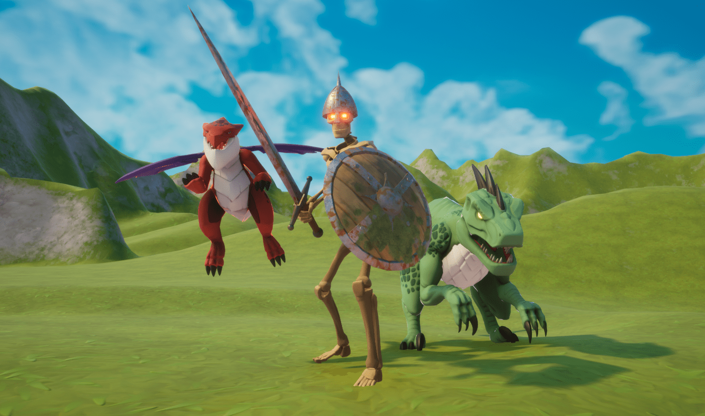

# Core NPC AI Kit

Kit for adding NPCs and a solution for NPC+Player combat.

Contains:

- 9 enemy designs, melee and ranged
- Example Rifle that damages both NPCs and Players
- Components for assembling a variety of NPC encounter types
- Waypoint system for patrols and paths
- Ambush-style spawn camp example
- MOBA example

## Known issues

- Consumes a large amount of the networking budget.
- Ranged NPCs might get stuck shooting at a wall if the target is on the other side, without adapting their targeting.
- Allied NPCs can get stuck on each other if running exactly in opposite directions.

## Tutorials

Check out our [YouTube playlist](https://www.youtube.com/watch?v=fz5y8MRXM7w&list=PLypj8hyU_Lh4ijMGMUQH_AUwKMvHhIoFq) to learn how to use the NPC AI Kit.

## Feedback & Support

Please use GitHub issues or my [thread on the Core Forums](https://forums.coregames.com/t/video-enemy-npcs-ai/392) for feedback and support.

## Contributing

If you are interested in fixing issues and contributing directly to the code base, please see our [contributing guidelines](CONTRIBUTING.md).

## License

Licensed under the [XX](LICENSE) license.
